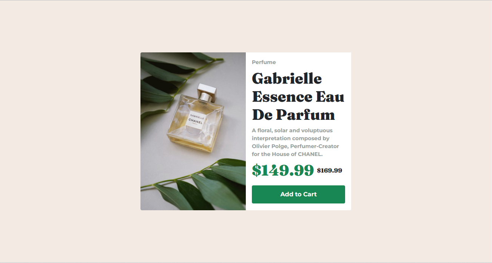
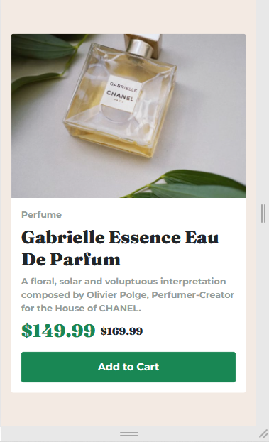

# Frontend Mentor - Product preview card component solution

This is a solution to the [Product preview card component challenge on Frontend Mentor](https://www.frontendmentor.io/challenges/product-preview-card-component-GO7UmttRfa). Frontend Mentor challenges help you improve your coding skills by building realistic projects. 

## Table of contents

- [Overview](#overview)
  - [The challenge](#the-challenge)
  - [Screenshot](#screenshot)
  - [Links](#links)
- [My process](#my-process)
  - [Built with](#built-with)
  - [What I learned](#what-i-learned)
  - [Continued development](#continued-development)
- [Author](#author)
- [Acknowledgments](#acknowledgments)

## Overview

### The challenge

Users should be able to:

- View the optimal layout depending on their device's screen size
- See hover and focus states for interactive elements

### Screenshot

### Links

- Solution URL: (https://www.frontendmentor.io/solutions/product-preview-card-component-in-htmlcss-XbWFud3I8P)
- Live Site URL:(https://ozioma45.github.io/Frontendmentor_challenges/product-preview-card-component-main/)

## My process

### Built with

- Semantic HTML5 markup
- CSS custom properties
- Flexbox
- CSS Grid
- Mobile-first workflow
- [Boostrap](https://getbootstrap.com/docs/5.0/) - Css framework

### What I learned

This is indeed an interesting and challenging project and i really learnt alot. It has really been a while i designed with bootstrap, so getting to understand it syntax and arrangement was not very use even with the documentation available but am really glad the project gave a broad understanding of the framework

### Continued development

While the Grid system with bootstrap is still not fully clear to me. i intend to use it more often in my future projects for better understanding and implimentation.

## Author

- Frontend Mentor - [@Ozioma45](https://www.frontendmentor.io/profile/Ozioma45)
- Twitter - [@EgoleOzioma](https://www.twitter.com/EgoleOzioma)
- Instagram - [gospel_egole](https://www.instagram.com/gospel_egole)
